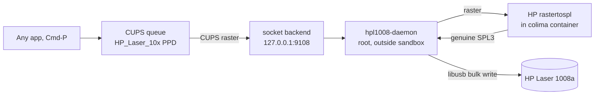

# HP Laser 1008a on macOS (native Cmd-P driver)

Make the **HP Laser 1003 / 1006 / 1008 (a/w)**, which is HP's rebadged Samsung SPL3
laser, print from **Apple Silicon macOS** like a normal printer. `Cmd-P` from any app.
No terminal, no per-job scripts.

HP never shipped a working macOS driver for these. They are not AirPrint, they do not
speak PostScript or PCL, and the open-source SPL/QPDL drivers (splix, foo2zjs) do not
produce a stream this unit accepts (I tested current SpliX 2.0.2 too, see
[What about SpliX?](#what-about-splix) below). So this project runs **HP's own
`rastertospl`**, the exact codec taken from HP's Unified Linux Driver, inside a tiny
Linux container, and delivers the result over USB itself.

> Tested on macOS 26 (Apple Silicon). USB-only "a" models and USB-connected "w" models.

## Install (the whole thing, one command)

Plug the printer in over USB, then paste this into Terminal and press return:

```bash
git clone https://github.com/Kuberwastaken/hp-laser-1008a-macos.git && cd hp-laser-1008a-macos && ./install.sh
```

That is it. It will ask for your Mac password once, set everything up, and your printer
appears as **"HP Laser 1008a"**. Print to it from any app with `Cmd-P`.

The only prerequisite is [Homebrew](https://brew.sh) (Apple's package manager). If you
do not have it, install it first by pasting the one line from that page, then run the
command above.

To test from the terminal instead:

```bash
lp -d HP_Laser_1008a /etc/hosts
```

To remove everything later: `./uninstall.sh`.

---

## Why this is weird (and how it works)

The HP Laser 100 series is a genuinely awkward printer on a Mac:

| What you'd try | What happens |
| --- | --- |
| AirPrint / driverless | Not offered. The printer's USB HTTP endpoint serves no IPP |
| Generic PCL / PostScript | Printer speaks neither, so the CUPS backend hangs "offline" |
| splix 2.0.1 / 2.0.2 | Garbled: striped raster at the page origin, repeated sheets (tested, see below) |
| foo2zjs `foo2qpdl` | `SPL ERROR - Please use the proper driver` |
| HP's macOS driver | Does not exist |

The printer literally asks for "the proper driver." That driver exists as an **x86 and
arm64 Linux binary** (`rastertospl`) in HP's Unified Linux Driver. It cannot run on
macOS directly, but it runs natively in a Linux ARM64 container.

There is a second wall: even with correct SPL3, macOS's `usb` backend refuses to send to
this printer (it mis-reads the USB port status as permanently "offline"), and on recent
macOS only **root** can talk to USB at all. And CUPS filters/backends run in a
**mandatory sandbox** that blocks both the container and USB. So the pipeline is split:



* The **CUPS queue** renders to CUPS raster and streams it to `socket://127.0.0.1:9108`
  using CUPS's own (sandbox-allowed) `socket` backend.
* A **root LaunchDaemon** listens there, runs the raster through HP's `rastertospl` in
  the `hp-spl` container to produce real SPL3, and writes it straight to the printer's
  USB bulk endpoint with libusb. Those are the two things the sandbox forbids, done
  outside it.

## What about SpliX?

SpliX **2.0.2** (2026) added HP Laser 10x support: QPDL version 3, a 512-byte packet
size, and a per-paper band-width table for the Samsung M2020 family, whose printers
"do not work unless they receive exactly the right band widths."

I tested it properly on the HP Laser 1008a:

* built SpliX 2.0.2 on macOS and confirmed **by source instrumentation** that its
  band-width table engages and returns the correct value (608 bytes for A4 at 600 dpi);
* fed the resulting QPDL through the exact same USB path that prints HP's `rastertospl`
  output correctly.

It still comes out malformed: a striped patch of raster at the top-left of each sheet,
the page ejects, and the printer believes another page is coming, so it repeats. The
same raster through HP's own `rastertospl` prints a clean page over the identical
transport. So this is an encoder problem, not transport.

SpliX's HP 10x support is real, but it targets the Samsung M2020 / HP Laser 103-108 wire
format (upstream PR #9 even notes the HP models were "not tested"), and the HP Laser
**1008a** (HP's separate 1003-1008 series) apparently needs something more or different
in the SPL3 page/band framing that SpliX does not emit. That is why this project uses
HP's own codec.

**Help wanted.** I built this so my family and I can print from our Macs, and I would
love a cleaner ending. If you can pin down the exact byte-level difference between HP's
`rastertospl` output and SpliX's for this printer (band/page records, compression
selector, page-end / job-end opcodes), SpliX could likely be patched and colima dropped
entirely. Issues, ideas, and PRs are very welcome.

## What the installer sets up

* `colima` + `docker` + `libusb` via Homebrew, and a small always-on Linux VM.
* The `hp-spl` container image (HP's `rastertospl`, fetched from HP, not shipped here).
* A root LaunchDaemon (`com.hpl1008.daemon`) and the `HP_Laser_1008a` print queue.
* A login item so the Linux VM starts after a reboot (see notes below).

## Notes and limitations

* **First print after idle is a bit slow (about 10 to 15 seconds).** That is the
  printer waking from its aggressive auto-power-off and heating the fuser, not the
  software (the conversion plus USB write take about 1 second). Back-to-back pages are
  quick.
* **colima must be running.** The installer adds a login item to start it. On a fresh
  reboot the very first print waits (up to about a minute) for the VM to come up rather
  than failing, then prints. On **managed (Jamf) Macs** where `~/Library/LaunchAgents`
  is locked, the installer falls back to a Login Item app. If it could not add one, add
  `colima start` yourself under System Settings, General, Login Items.
* **Different USB product id?** If `direct_write.py` says "printer not found" while
  `ioreg -p IOUSB -l | grep -iA2 "HP Laser"` shows the device, update `PID` in
  `~/.hp1008/direct_write.py` to the `idProduct` you see.
* **Logs:** `/private/tmp/hpl1008-daemon.log`.

## Legal

This repo contains only glue code. It does **not** redistribute HP's driver. `install.sh`
downloads the Unified Linux Driver from HP at install time. `rastertospl` and the PPD are
HP's; using them to drive a printer you own is ordinary driver use.

## Credits

Built by reverse-engineering the failure modes the printer itself reported. Thanks to the
[splix](https://github.com/OpenPrinting/splix) and [foo2zjs](https://github.com/koenkooi/foo2zjs)
projects (the SPL2/QPDL detour that proved the transport worked), Pierov's
[HP Laser 107a on Linux](https://www.pierov.org/2023/07/25/hp-laser-107a-linux/) writeup,
and HP's Unified Linux Driver for the actual SPL3 codec.

## License

MIT, see [LICENSE](LICENSE).
